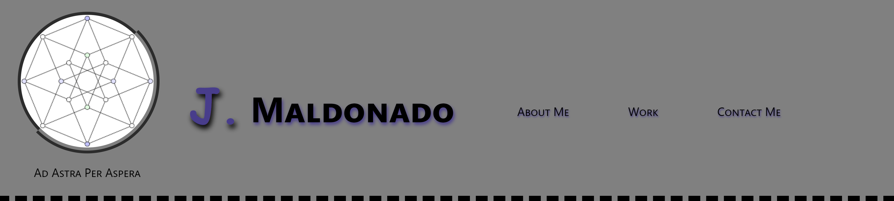
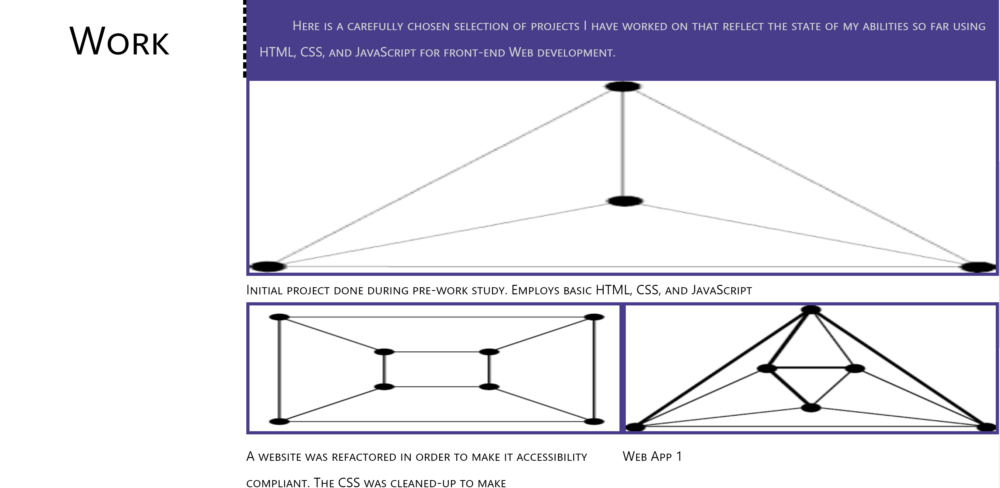

# My Professional Portfolio
## Description
With the purpose of having a publicly deployed page in which to exhibit my best work,
I decided to start this project, with open source code available at GitHUb (URL of the remote repo:https://github.com/jguemarez/MyProfessionalPortfolio). Here you will find: some personal information about me 
as a means of introduction; my five best deployed Web Apps; and, ways to contact me.
The static Web page (URL: https://jguemarez.github.io/MyProfessionalPortfolio/#Work)was created using HTML5 and CSS code, including some media queries in the latter
for a little bit of responsiveness to variations of screen size.
## Usage
The structure of the website is very simple and intuitive. On the right-hand side of the header you will find a navigation bar with links to each of the main areas of the page, each one having a self-explenatory title:

The most important section is the one title "Work":

There you will find a sample of my best work so far. Each of the images link to the deployed Web page of the chosen project. 
The next section offers up my cellphone numbers and my e-mail address for any comments
or inquiries.
## Support
In case of any doubt or to report a bug, please contact me at 
cantor.dedekind112358@gmail.com
## Contributions
Due to the personal nature of this project, I will not be accepting contributions.
However, you are welcome to raise issues suggesting modifications to it. Anyone can 
download the code from the repository and refurbish as needed for their own purposes.
## Author
The HTML code in index.html and the CSS code found in the style.css file of the repository at https://github.com/jguemarez/MyProfessionalPortfolio are of my lone 
authorship.
However, the reset.css files and the .gitignore files where taken from the course documents available in GitLab.

reset.css:

https://git.bootcampcontent.com/Rutgers-University/RUT-VIRT-FSF-PT-06-2023-U-LOLC/-/blob/main/02-Advanced-CSS/01-Activities/11-Ins_CSS-Resets/assets/css/reset.css

.gitignore

https://git.bootcampcontent.com/Rutgers-University/RUT-VIRT-FSF-PT-06-2023-U-LOLC/-/blob/main/.gitignore

All the placeholder images where found through Google search and are in the public domain, so far as I am aware.
## License

MIT License.

For more info, go to the LICENSE file in the remote repo.